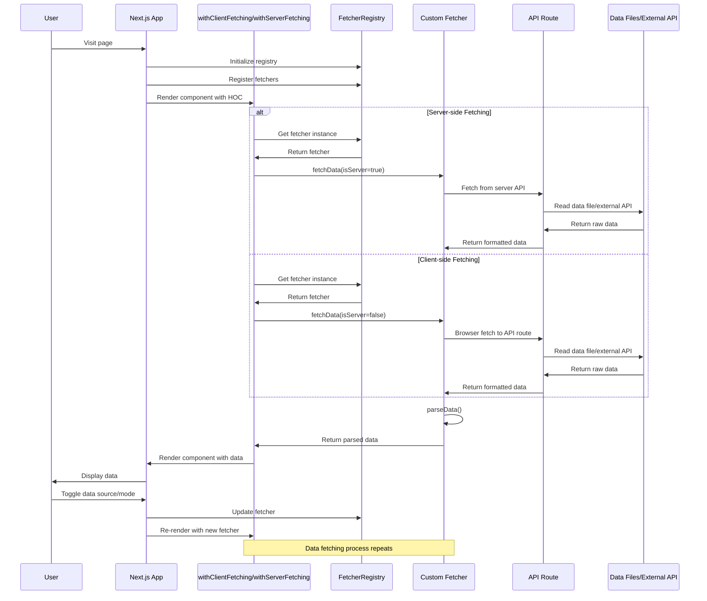
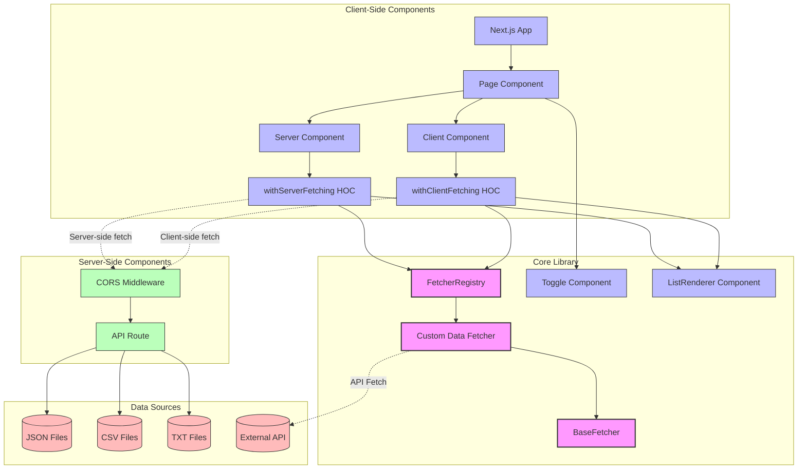

# Next Data Fetcher

A flexible data fetching library for Next.js applications that supports multiple data sources and both client-side and server-side data fetching. This package simplifies the process of fetching and displaying data in your Next.js application.

## Features

- 🔄 Seamless switching between server-side and client-side data fetching
- 📊 Support for multiple data sources: JSON, CSV, TXT, and APIs
- 🧩 Component-based architecture with HOCs for easy integration
- 🔌 Pluggable fetcher system with a central registry
- 📱 TypeScript support for type safety

## Data Fetching Flow

### Sequence Diagram


### Component Structure



## Installation

```bash
npm install next-data-fetcher
# or
yarn add next-data-fetcher
# or
pnpm add next-data-fetcher
```

## Quick Start

### 1. Setup API Route for Server-Side Data

Create an API route to serve your data files:

```typescript
// app/api/data/route.ts
import { NextRequest, NextResponse } from 'next/server';
import { DataSourceType } from 'next-data-fetcher';
import fs from 'fs';
import path from 'path';

// Helper function that reads data from files (server-side only)
async function fetchDataFromFile(componentId: string, dataSource: DataSourceType = 'json'): Promise<any[] | string> {
  const extension = dataSource === 'json' ? 'json' : 
                   dataSource === 'csv' ? 'csv' : 
                   dataSource === 'txt' ? 'txt' : 'json';
                   
  const fileName = componentId.replace('Data', '').toLowerCase();
  
  try {
    // Path to the data file
    const filePath = path.join(process.cwd(), 'app', 'data', `${fileName}s.${extension}`);
    
    // Read file based on type
    if (dataSource === 'json') {
      const fileContent = fs.readFileSync(filePath, 'utf8');
      return JSON.parse(fileContent);
    } else if (dataSource === 'csv' || dataSource === 'txt') {
      const fileContent = fs.readFileSync(filePath, 'utf8');
      return fileContent; // Return raw content as string
    }
    
    return [];
  } catch (error) {
    console.error(`Error reading ${extension} file for ${componentId}:`, error);
    throw new Error(`Failed to read data file for ${componentId} with format ${extension}`);
  }
}

export async function GET(request: NextRequest) {
  // Get query parameters
  const searchParams = request.nextUrl.searchParams;
  const component = searchParams.get('component');
  const dataSource = (searchParams.get('dataSource') || 'json') as DataSourceType;
  
  if (!component) {
    return NextResponse.json({ error: 'Component parameter is required' }, { status: 400 });
  }
  
  try {
    // Now fetchDataFromFile is directly called from the API route
    const data = await fetchDataFromFile(component, dataSource);
    
    // Return appropriate response based on data source
    if (dataSource === 'json') {
      return NextResponse.json(data);
    } else if (dataSource === 'csv' || dataSource === 'txt') {
      return new NextResponse(data as string, {
        headers: {
          'Content-Type': dataSource === 'csv' ? 'text/csv' : 'text/plain',
        },
      });
    }
    
    return NextResponse.json({ error: 'Unsupported data source' }, { status: 400 });
  } catch (error: any) {
    console.error('API route error:', error);
    return NextResponse.json({ error: error.message || 'Failed to fetch data' }, { status: 500 });
  }
}
```

### 2. Create a Middleware (Required)

To handle CORS and API requests properly, create a middleware.ts file in your root directory:

```typescript
// middleware.ts
import { NextResponse } from 'next/server';
import type { NextRequest } from 'next/server';

export function middleware(request: NextRequest) {
  const response = NextResponse.next();

  response.headers.set('Access-Control-Allow-Origin', '*');
  response.headers.set('Access-Control-Allow-Methods', 'GET, POST, PUT, DELETE, OPTIONS');
  response.headers.set('Access-Control-Allow-Headers', 'Content-Type, Authorization');

  return response;
}

export const config = {
  matcher: '/api/:path*',
};
```

> **Important Note**: The middleware.ts file must be created or you'll receive an error: "Error: The Middleware "/middleware" must export a `middleware` or a `default` function".

### 3. Create Your Data Fetcher

Create a custom fetcher for your data model:

```typescript
// fetchers/UserDataFetcher.ts
import { BaseFetcher, DataSourceType } from "next-data-fetcher";

export interface User {
  id: number;
  name: string;
  email: string;
}

export class UserDataFetcher extends BaseFetcher<User> {
  constructor(dataSource: DataSourceType = 'json') {
    super({
      componentId: 'UserData',
      dataSource,
      endpoint: dataSource === 'api' ? 'https://your-api-endpoint.com/users' : undefined
    });
  }

  parseData(data: any): User[] {
    // Handle different data structures based on source
    if (Array.isArray(data)) {
      return data.map(user => ({
        id: typeof user.id === 'number' ? user.id : parseInt(user.id) || 0,
        name: user.name || 'Unknown',
        email: user.email || 'No email'
      }));
    }
    
    if (data.users && Array.isArray(data.users)) {
      return data.users.map((user: any) => ({
        id: typeof user.id === 'number' ? user.id : parseInt(user.id) || 0,
        name: user.name || 'Unknown',
        email: user.email || 'No email'
      }));
    }
    
    return [];
  }
}
```

### 4. Create a Display Component

Create a component to display your data:

```typescript
// components/UserList.tsx
'use client';

import React from 'react';
import { ListRenderer } from 'next-data-fetcher';
import { User } from '../fetchers/UserDataFetcher';

interface UserListProps {
  data?: User[];
}

export function UserList({ data = [] }: UserListProps) {
  return (
    <ListRenderer
      data={data}
      title="User List"
      renderItem={(user) => (
        <div className="user-card">
          <h3>{user.name}</h3>
          <p>Email: {user.email}</p>
          <p>ID: {user.id}</p>
        </div>
      )}
    />
  );
}
```

### 5. Set Up Your Page with Data Fetching

Use the HOCs to add data fetching capabilities to your components:

```typescript
// app/page.tsx
'use client';

import React, { useEffect, useState, useCallback } from 'react';
import { UserList } from './components/UserList';
import { 
  withServerFetching, 
  withClientFetching, 
  FetcherRegistry,
  DataSourceType, 
  Toggle 
} from 'next-data-fetcher';
import { UserDataFetcher } from './fetchers/UserDataFetcher';

export default function Home() {
  const [isServer, setIsServer] = useState<boolean>(true);
  const [dataSource, setDataSource] = useState<DataSourceType>('json');
  const [isInitialized, setIsInitialized] = useState<boolean>(false);
  const [key, setKey] = useState<number>(0);

  // Initialize fetchers on component mount
  useEffect(() => {
    const registry = FetcherRegistry.getInstance();
    registry.register('UserData', new UserDataFetcher(dataSource));
    setIsInitialized(true);
  }, []);

  // Update fetchers when dataSource changes
  useEffect(() => {
    if (!isInitialized) return;
    
    const registry = FetcherRegistry.getInstance();
    registry.register('UserData', new UserDataFetcher(dataSource));
    
    // Force re-render of components by updating the key
    setKey(prevKey => prevKey + 1);
  }, [dataSource, isInitialized]);

  const handleToggleMode = useCallback((server: boolean) => {
    setIsServer(server);
    // Force re-render when toggling between client and server
    setKey(prevKey => prevKey + 1);
  }, []);

  const handleChangeDataSource = useCallback((source: DataSourceType) => {
    setDataSource(source);
  }, []);

  // Only render content after initialization
  if (!isInitialized) {
    return <div>Initializing data fetchers...</div>;
  }

  // Create components with the current key to force re-creation when needed
  const ServerUserList = withServerFetching(UserList, 'UserData');
  const ClientUserList = withClientFetching(UserList, 'UserData');

  return (
    <main className="container">
      <h1>Next.js Data Fetching Example</h1>
      
      <Toggle 
        onToggleMode={handleToggleMode}
        onChangeDataSource={handleChangeDataSource}
        isServer={isServer}
        dataSource={dataSource}
      />
      
      <div className="content">
        {isServer ? (
          <ServerUserList key={`server-user-${key}`} />
        ) : (
          <ClientUserList key={`client-user-${key}`} />
        )}
      </div>
    </main>
  );
}
```

### 6. Prepare Your Data Files

Create a data directory in your app folder and add your data files:

```
app/
├── data/
│   ├── users.json
│   ├── users.csv
│   └── users.txt
```

Example JSON file (users.json):
```json
[
  {"id": 1, "name": "John Doe", "email": "john@example.com"},
  {"id": 2, "name": "Jane Smith", "email": "jane@example.com"},
  {"id": 3, "name": "Bob Johnson", "email": "bob@example.com"}
]
```

## Advanced Usage

### Custom Data Sources

You can extend the `BaseFetcher` class to implement your own data sources:

```typescript
export class CustomDataFetcher extends BaseFetcher<YourDataType> {
  constructor() {
    super({
      componentId: 'CustomData',
      dataSource: 'json', // or any other supported type
    });
  }

  parseData(data: any): YourDataType[] {
    // Implement your custom parsing logic
    return data.map(item => ({
      // Map your data to your model
    }));
  }
  
  // You can also override fetchData or other methods
  async fetchData(isServer = false): Promise<YourDataType[]> {
    // Custom fetching implementation
    return super.fetchData(isServer);
  }
}
```

### Using Environment Variables

You can configure the base URL for your API endpoints using environment variables:

```
# .env.local
NEXT_PUBLIC_API_BASE_URL=http://localhost:3000
```

### Different Data Formats Support

The library supports different data formats out of the box:

1. **JSON**: Default format for structured data
2. **CSV**: For tabular data
3. **TXT**: For text-based data with simple parsing
4. **API**: For external API endpoints

## API Reference

### Core Components

#### BaseFetcher

The abstract base class for all data fetchers.

```typescript
abstract class BaseFetcher<T> {
  constructor(options: FetcherOptions);
  abstract parseData(data: any): T[];
  async fetchData(isServer?: boolean, componentId?: string): Promise<T[]>;
}
```

#### FetcherRegistry

A singleton registry for managing fetchers.

```typescript
class FetcherRegistry {
  static getInstance(): FetcherRegistry;
  register(componentId: string, fetcher: BaseFetcher<any>): void;
  getFetcher(componentId: string): BaseFetcher<any> | undefined;
  setApiBasePath(path: string): void;
  getApiBasePath(): string;
  setBaseUrl(url: string): void;
  getBaseUrl(): string;
}
```

### Higher-Order Components

#### withClientFetching

HOC for adding client-side data fetching capabilities.

```typescript
function withClientFetching<T, P extends { data?: T[] }>(
  WrappedComponent: React.ComponentType<P>,
  componentId: string
): React.FC<Omit<P, "data">>;
```

#### withServerFetching

HOC for adding server-side data fetching capabilities.

```typescript
function withServerFetching<T, P extends { data?: T[] }>(
  WrappedComponent: React.ComponentType<P>,
  componentId: string
): React.FC<Omit<P, "data">>;
```

### UI Components

#### ListRenderer

A generic component for rendering lists.

```typescript
function ListRenderer<T>({
  data,
  renderItem,
  title,
  className,
  listClassName,
  itemClassName,
}: ListRendererProps<T>): JSX.Element;
```

#### Toggle

A component for toggling between server-side and client-side data fetching.

```typescript
function Toggle({
  onToggleMode,
  onChangeDataSource,
  isServer,
  dataSource,
}: ToggleProps): JSX.Element;
```

## Troubleshooting

### Common Issues

1. **Middleware Error**
   
   Error: "The Middleware "/middleware" must export a `middleware` or a `default` function"
   
   Solution: Make sure you have created the middleware.ts file in your project root as shown in the setup instructions.

2. **Data Files Not Found**
   
   Error: "Failed to read data file for [componentId] with format [extension]"
   
   Solution: Ensure your data files are in the correct location (app/data/) and named correctly (lowercase component name without 'Data' + 's' + extension).

3. **CORS Issues**
   
   If you're experiencing CORS issues, make sure the middleware is properly configured to handle CORS headers.

## License

MIT